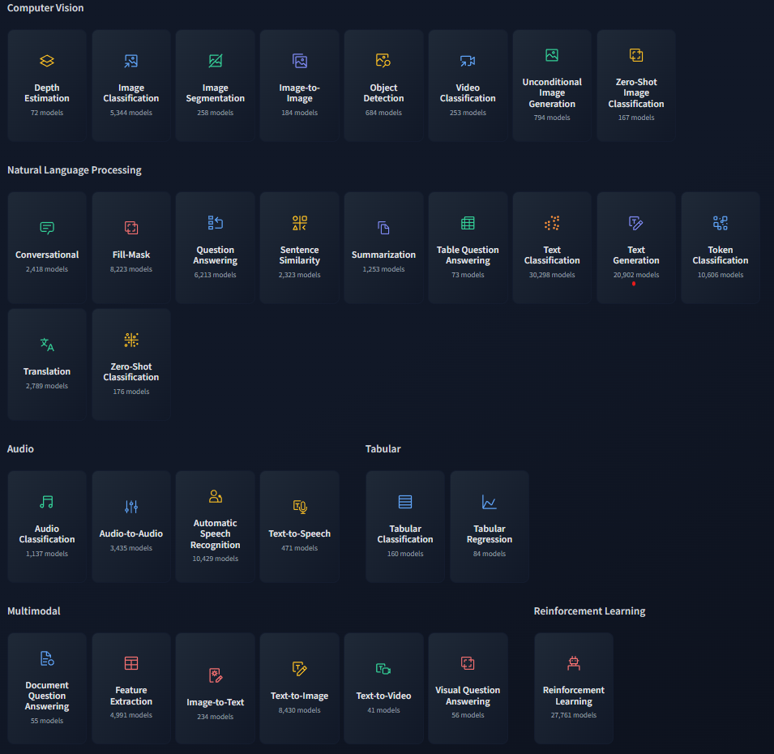

# Introduction

## Project goals

Since this project is open in nature and we are free to choose your own direction and the fact that we are provided repositories of already implemented models, we realize that the project goals are not as clear as in previous assignments where we were hand-held the entire process.  
Further with the rapid recent advancements in the field of deep learning, we're certain we cannot compete with the state of the art. thus we seek some other fruitful approach to this project with which we can learn and gain from.  

### We have decided to focus on **Learning & Experience**  

We want to learn and gain experience as much as possible from this project. We want to study more about the tools and frameworks used today and how we can leverage them  
Instead of focusing on success metrics we will focus on summarizing our learning and experience in this report.

## Hugging Face

Historically a chatbot and today a frontier for everything NLP.  Hugging Face has developed a collection of libraries for SOTA NLP models and tasks and only looking to expand.  
Since 2022 [Hugging Face wants to be GitHub of machine learning](https://www.ai.nl/artificial-intelligence/hugging-face-wants-to-be-github-of-machine-learning-a-look-at-its-history-key-members-and-major-achievements/) they're quickly getting there. if only a proof to that is another round of investment into by [Google, Amazon, Nvidia, and others put $235 million into Hugging Face](https://www.theverge.com/2023/8/24/23844444/google-amazon-nvidia-hugging-face-generative-ai-investment)

Today, Hugging Face offers a number of data science hosting and development tools, including a GitHub-like hub for AI code repositories, models and datasets, as well as web apps to demo AI-powered applications. It also provides libraries for tasks like dataset processing and evaluating models in addition to an enterprise version of the hub that supports software-as-a-service and on-premises deployments [\[TechCrunch\]](https://techcrunch.com/2023/08/24/hugging-face-raises-235m-from-investors-including-salesforce-and-nvidia/?guccounter=1)  

Seeing the effort and achievements of Hugging Face we decided to focus our project on it.

### What Hugging Face has to offer for us?

A non comprehensive list of libraries and tools provided by Hugging Face:
| Library (Docs/Github) | Description by HuggingFace                                                                   | TLDR? Why do we care?                                |
| :-------------------- | :------------------------------------------------------------------------------------------- | :--------------------------------------------------- |
| Accelerate            | Easily train and use PyTorch models with multi-GPU, TPU, mixed-precision.                    |                                                      |
| AutoTrain             | AutoTrain API and UI                                                                         |                                                      |
| Datasets              | Access and share datasets for computer vision, audio, and NLP tasks.                         |                                                      |
| Diffusers             | State-of-the-art diffusion models for image and audio generation in PyTorch.                 |                                                      |
| Evaluate              | Evaluate and report model performance easier and more standardized.                          |                                                      |
| Hub                   | Host Git-based models, datasets and Spaces on the Hugging Face                               |                                                      |
| Hub Python Library    | Client library for the HF Hub: manage repositories from your Python runtime.                 |                                                      |
| PEFT                  | Parameter efficient finetuning methods for large models                                      |                                                      |
| Safetensors           | Simple, safe way to store and distribute neural networks weights safely and quickly.         |                                                      |
| Transformers          | State-of-the-art ML for Pytorch, TensorFlow, and JAX.                                        |                                                      |
| Gradio                | Build machine learning demos and other web apps, in just a few lines of Python.              |                                                      |
| Inference API         | Experiment with over 200k models easily using our free Inference API.                        | Inference over the internet without any setup!       |
| Optimum               | Fast training and inference of HF Transformers with easy to use hardware optimization tools. | [PyTorch's BetterTransformer] [AutoGPTQ Integration] |
| Tokenizers            | Fast tokenizers, optimized for both research and production.                                 |                                                      |
| Datasets-server       | API to access the contents, metadata and basic statistics of all Hugging Face Hub datasets.  | API for querying information about datasets          |
| TRL                   | Train transformer language models with reinforcement learning.                               | Reinforcement Learning!                              |

[PyTorch's BetterTransformer]: <https://huggingface.co/docs/optimum/quicktour#pytorchs-bettertransformer-support>
[AutoGPTQ Integration]: <https://huggingface.co/docs/optimum/llm_quantization/usage_guides/quantization#quantization>

And if that wasn't enough! [Hugging face support even more libraries!](https://huggingface.co/docs/hub/models-libraries) via integration with the Hub:  

* [Integrate your library with the Hub](https://huggingface.co/docs/hub/models-adding-libraries)

| Library                    | Description by HuggingFace                                                                                               | Download from Hub | Push to Hub |
| :------------------------- | :----------------------------------------------------------------------------------------------------------------------- | :---------------- | :---------- |
| Adapter Transformers       | Extends 🤗Transformers with Adapters.                                                                                   | ✅                | ✅          |
| AllenNLP                   | An open-source NLP research library, built on PyTorch.                                                                   | ✅                | ❌          |
| Asteroid                   | Pytorch-based audio source separation toolkit                                                                            | ✅                | ❌          |
| BERTopic                   | BERTopic is a topic modeling library for text and images                                                                 | ✅                | ✅          |
| docTR                      | Models and datasets for OCR-related tasks in PyTorch & TensorFlow                                                        | ✅                | ❌          |
| ESPnet                     | End-to-end speech processing toolkit (e.g. TTS)                                                                          | ✅                | ❌          |
| fastai                     | Library to train fast and accurate models with state-of-the-art outputs.                                                 | ✅                | ✅          |
| Keras                      | Library that uses a consistent and simple API to build models leveraging TensorFlow and its ecosystem.                   | ✅                | ✅          |
| Flair                      | Very simple framework for state-of-the-art NLP.                                                                          | ✅                | ❌          |
| MBRL-Lib                   | PyTorch implementations of MBRL Algorithms.                                                                              | ✅                | ✅          |
| ML-Agents                  | Enables games and simulations made with Unity to serve as environments for training intelligent agents.                  | ✅                | ✅          |
| NeMo                       | Conversational AI toolkit built for researchers                                                                          | ✅                | ❌          |
| PaddleNLP                  | Easy-to-use and powerful NLP library built on PaddlePaddle                                                               | ✅                | ✅          |
| Pyannote                   | Neural building blocks for speaker diarization.                                                                          | ✅                | ❌          |
| PyCTCDecode                | Language model supported CTC decoding for speech recognition                                                             | ✅                | ❌          |
| Pythae                     | Unifyed framework for Generative Autoencoders in Python                                                                  | ✅                | ✅          |
| RL-Baselines3-Zoo          | Training framework for Reinforcement Learning, using Stable Baselines3.                                                  | ✅                | ✅          |
| Sample Factory             | Codebase for high throughput asynchronous reinforcement learning.                                                        | ✅                | ✅          |
| Sentence Transformers      | Compute dense vector representations for sentences, paragraphs, and images.                                              | ✅                | ✅          |
| spaCy                      | Advanced Natural Language Processing in Python and Cython.                                                               | ✅                | ✅          |
| SpanMarker                 | Familiar, simple and state-of-the-art Named Entity Recognition.                                                          | ✅                | ✅          |
| Scikit Learn (using skops) | Machine Learning in Python.                                                                                              | ✅                | ✅          |
| Speechbrain                | A PyTorch Powered Speech Toolkit.                                                                                        | ✅                | ❌          |
| Stable-Baselines3          | Set of reliable implementations of deep reinforcement learning algorithms in PyTorch                                     | ✅                | ✅          |
| TensorFlowTTS              | Real-time state-of-the-art speech synthesis architectures.                                                               | ✅                | ❌          |
| Timm                       | Collection of image models, scripts, pretrained weights, etc.                                                            | ✅                | ✅          |
| Transformers.js            | State-of-the-art Machine Learning for the web. Run 🤗 Transformers directly in your browser, with no need for a server! | ✅                | ❌          |
<!-- [Title](https://github.com/fcakyon/ultralyticsplus) -->
<!-- [Title](https://github.com/mindee/doctr) -->
It is clear that almost any library that is used today is supports Hugging Face Hub.

### Using Hugging Face

#### Pipeline

Hugging Face provides access to SOTA models for various computer vision tasks with a simple API.  
As of today, the following tasks are supported:  

  

<!-- Our task is trash object detection thus we will forucs on the following models (again, non-comprehensive list):
| Task                   | Models                                |
| ---------------------- | ------------------------------------- |
| Image Classification   | ViT, DeiT, ConvNeXT, Swin Transformer |
| **Object Detection**   | **DETR, Masked R-CNN**                |
| Image Segmentation     | MaskFormer, SETR                      |
| Video Classification   | TimeSformer, MV-ViT                   |
| Image Generation       | DALL-E 2                              |
| Self-Supervised Models | BEiT, MAE, MaskFeat                   |
| Vision-Language Models | VL-T5, ViLT                           | -->

#### The Hub

Today the hugging face website is a hub for people to upload their models and datasets for the public. unless specifically set to private all models and datasets are available for everyone to use.
In fact we can see a few familar faces and Even other people who implemented our task!
TODO:Insert that uni
TODO:insert that person

#### Datasets

[A data-centric view on reliable generalization: From ImageNet to LAION-5B](https://www.youtube.com/watch?v=cognZ12dpAM)

##### Augmentation

#### Models

#### Evaluation

* Metric: A metric is used to evaluate a model’s performance and usually involves the model’s predictions as well as some ground truth labels. You can find all integrated metrics at evaluate-metric.
* Comparison: A comparison is used to compare two models. This can for example be done by comparing their predictions to ground truth labels and computing their agreement. You can find all integrated comparisons at evaluate-comparison.
* Measurement: The dataset is as important as the model trained on it. With measurements one can investigate a dataset’s properties. You can find all integrated measurements at evaluate-measurement.
Most important of all is [creating and sharing a new evaluation](https://huggingface.co/docs/evaluate/main/en/creating_and_sharing)

#### Training

##### PEFT: Parameter Efficient Fine-Tuning

## Summary and Conclusion

Comparisons,
| Model | Training time | Inference time | FLOPS | Parameters | Memory Requirements | Metric Score |
| :---- | :------------ | :------------- | :---- | :--------- | :------------------ | :----------- |
|       |               |                |       |            |                     |              |
|       |               |                |       |            |                     |              |
|       |               |                |       |            |                     |              |

## Future investigations

This overview of hugging face is not comprehensive and we have only scratched the surface of what it has to offer.
We are aware of other frameworks and tools that are used today and we will try to investigate them in the future.
It might be worth while to understand the differences between the frameworks and how they compare to each other.
PyTorch Lightning
PyTorch Ignite
Pytorch Hub
Keras going multi-backend again [Introducing Keras Core: Keras for TensorFlow, JAX, and PyTorch.](https://keras.io/keras_core/announcement/)

## Bibliography, References short reviews and other resources

* Hugging Face Tutorials:
[Hugging Face Course](https://www.youtube.com/playlist?list=PLo2EIpI_JMQvWfQndUesu0nPBAtZ9gP1o)
[NLP-Course](https://huggingface.co/learn/nlp-course/chapter1/1)
[Getting Started With Hugging Face in 15 Minutes | Transformers, Pipeline, Tokenizer, Models](https://www.youtube.com/watch?v=QEaBAZQCtwE)

!! Insert more info about it !!
[Diving Deep with Hugging Face: The GitHub of Deep Learning & Large Language Models!](https://levelup.gitconnected.com/diving-deep-with-hugging-face-the-github-of-deep-learning-large-language-models-61767e468e66)  
  
  
[BigScience - Bloom](https://bigscience.huggingface.co/blog/bloom)

* Models are pretrained on large datasets like ImageNet, COCO, Kinetics,Conceptual Captions.

* OpenCV and PIL integrations allow feeding images directly to models.

* Vision pipelines provide OOTB inference for tasks like classification, object detection.

* Model repo READMEs document model architecture, training details.

* Models can be fine-tuned on new datasets using the Trainer API.

* Supports features like batched inference, mixed precision, multi-GPU training.

* Achieve leading metrics across computer vision tasks and datasets.

* Active community support for most popular vision models on Discussions forum.

<!-- The framework is open source and is used by many companies and researchers. The framework is built on top of PyTorch and TensorFlow 2.0. The framework is built to be easy to use and to be able to quickly prototype and experiment with different models. The framework is also built to be able to easily share models and to be able to use models that others have shared. The framework is built to be able to run on both CPU and GPU. -->
[What is Hugging Face - Crash Course (No Coding) | ML Products for Beginners](https://www.youtube.com/watch?v=x8gdOPO35HA)
